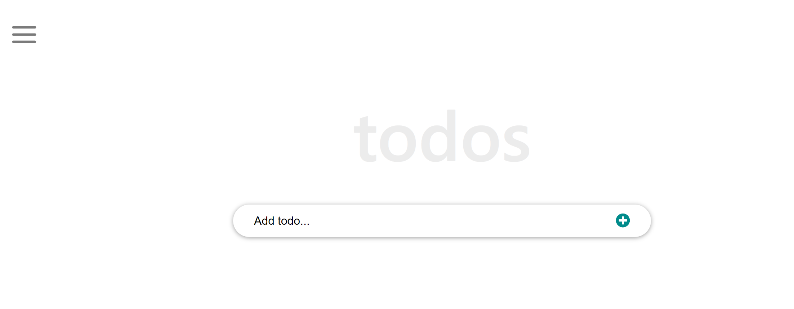

# React Tutorial - ToDos List

> This project is a ToDo list app built using React

- In this project, I created a ToDo list using React by following a step-by-step tutorial by [Ibaslogic](https://ibaslogic.com/react-tutorial-for-beginners/)

## Built With
- React, Webpack, Javascript, Babel

## Author
👤 **Gift Uwhubetine**

- GitHub: [@githubhandle](https://github.com/ghiftee)
- Twitter: [@twitterhandle](https://twitter.com/i_ghiftee)
- LinkedIn: [LinkedIn](https://linkedin.com/in/giftuwhubetine)

## Acknowledgments

- Ibaslogic
- Microverse

## 🤝 Contributing

Contributions, issues, and feature requests are welcome!

Feel free to check the [issues page](../../issues/).

## Show your support

Give a ⭐️ if you like this project!
